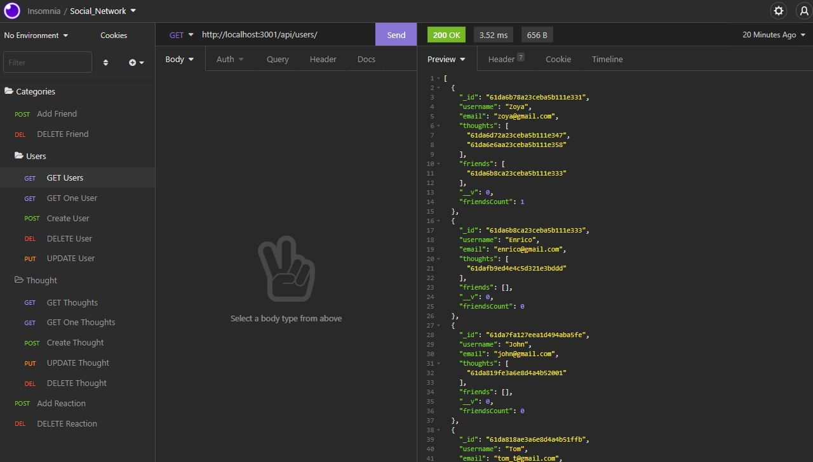

# Social Network API
 [](https://opensource.org/licenses/MIT)


  ## Table of contents
  - [Description](#description)
  - [Installation instructions](#installation-instructions)
  - [Usage information](#usage-information)
  - [License](#license)
  - [Questions](#questions)


  ## Description

This is an API for a social network web application where users can share their thoughts, react to friends’ thoughts, and create a friend list. 

* Includes User and Thought models.
* Includes Reactions as the reaction field's subdocument schema in the Thought model.
* Uses functionality to format queried timestamps properly.
* Application deletes a user's associated thoughts when the user is deleted.

Because this application is not deployed, you need to use 'Insomnia' to see functionality.
  
  

  #### Demo video

  [Social Network API Video Demonstration](https://drive.google.com/file/d/1crGXnZyW2tVFRjgK-psx1YJfB3jhQSDc/view?usp=sharing)

  #### For this project the following technologies were used:
  * Nodejs
  * MongoDB
  * npm express
  * npm mongoose

  Insomnia


  ## Installation instructions

  For dependancies run following comand:

  ```npm i```

  ## Usage information

  To use this app - run the following command:

 ```npm start```

 You’ll need to create your own data using Insomnia after you’ve created your API.

  ## License

  [](https://opensource.org/licenses/MIT)

  Usage is provided under [The MIT License](https://opensource.org/licenses/MIT). See LICENSE for the full details.

  ## Questions

  To reach me with additional questions

  GitHub: [Juliusm9791](https://github.com/Juliusm9791)

  Email: juliusm9791@gmail.com